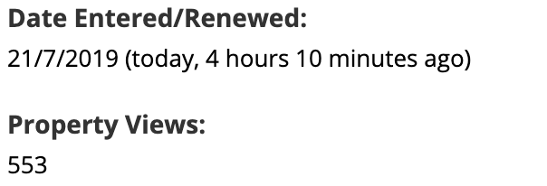
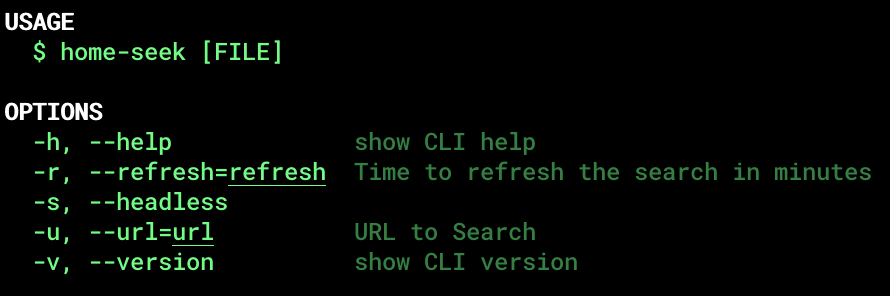
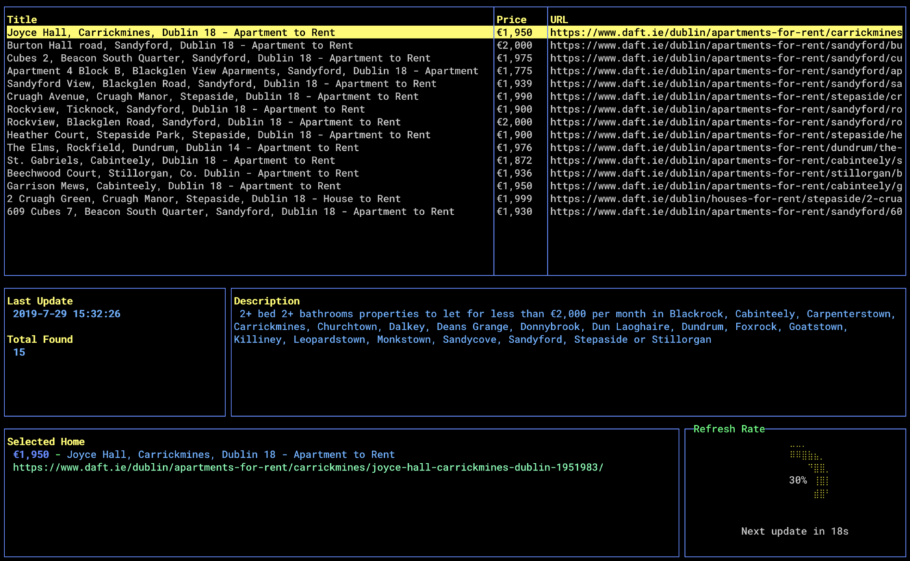

## Introduction

After two years living in Co. Kerry, Ireland my wife Kamila and I decided it was time to move. We were missing some opportunities, so we decided to go to Dublin.

Subsequently, when I got the job I was looking for was when the tough part came. Finding an apartment to rent.

Since the beginning of our thoughts in moving, we knew it was going to be hard to find an apartment. First of all, because it is getting harder every day to find a good apartment at a reasonable price in the Dublin area. As if that was not enough we have Pepo, a small 5-year-old Yorkshire Terrier dog who has always been part of our family. And Irish landlords are known to be not as pet-friendly as the could.

We knew the search was going to be hard if we were not in Dublin to visit the apartments and negotiate with the landlords. Then we made a plan. Coincidently, Kamila was going to Brazil on the same day I was starting in my new job. Also, I was going to Brazil 17 days later. So we decided I was going to get an Airbnb for this period while I was searching for a definitive place.

So, on my first day in the city, I accessed Daft (Ireland’s №1 Property Website, as they describe themselves) and started the search in the areas and budget we were interested in. After all the messages of interest sent I went to sleep dreaming of receiving all the responses in the following day. Mere illusion. Of those I’ve sent the message, two replied. One answered that all views were full and the other answered they didn’t accept pets.

But what about the others? Well, when you look carefully in the advertisement you can see how many people have visualized it. Then, based on that you can imagine how many messages the advertiser receives, making impossible to answer everybody, most probably leading to the first few the privilege of receiving an answer.

## Rationalization

Then I realized that there is an alert that you can configure in Daft. So any apartment that matches your filter will be sent to your email. I have configured it, while I was still refreshing the page every 5 minutes of my day.

I started receiving more answers but I was still missing some nice apartments. The email alerts sometimes were taking more than 30 minutes to arrive and also sometimes I forgot to check my email.

After one week and just 3 apartments visited I was seated at Starbucks searching for apartments and thinking what to do to increase the conversion rate of my queries.

Eureka! I will write some program to do all this search for me, so I will never miss one single apartment.

## Let’s Have Some Fun

So the fun part started. I’ve chosen Javascript, just because it is easy.

I also thought that maybe a CLI (Command Line Interface) was better, so I didn’t have to build any complex graphics or web browser application.

Then, I decided to use oclif, that has a very simple implementation. Also, I have used some other dependencies for scraping, notifications, etc.

I have thought also that once I would have a process running in my Terminal, I could build a simple dashboard using Blessed so I could have some feedback of what was happening.
So, the usage of the App was quite simple:

And the final screen was:

Also, I have implemented a Notification, so the App would compare the previous search with the current one, and if any new Apartment was found it would notify and already open a browser tab with the new results. This way I wouldn’t miss a second to take a look at the new opportunity.

## Results

Finally, after having a lot of fun implementing this on the weekend, a new Monday arrived and it was time to put the App to work. And it was a very productive week. I got a lot more of apartment viewings comparing to the previous one.

Lots of responses due to an early interest shown, so my emails and calls were on the first ones to reach the Agents.

Then, on Saturday I was at Costa (not loyal to Starbucks I know..) and received the notification of an apartment in the area I was looking for. There was a contact phone and I called.

Me: — Hi, I have just seen an apartment to let.

Agent: — Oh.. yeah… what a coincidence, I have just pressed the save button on Daft. But can you come tomorrow (Sunday) to view it?

Me: — Sure, I will be there!

So I went there, I was the only one she scheduled for Sunday. The apartment was pretty good with also a good price and I said, I want it. And she said, it’s yours.

I’d say if it wasn’t for this small bot I built probably I wouldn’t get a schedule for Sunday and I would need to compete with many more interested people.

## Ok, so how can I also use it?

If you read everything until here you might be curious about using it (or not), but home-seek is available at NPM:
https://www.npmjs.com/package/home-seek

Feel free to use it, open a Pull Request, give suggestions.

Thanks,
