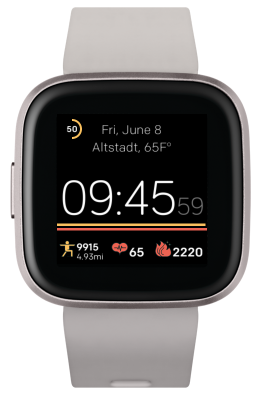
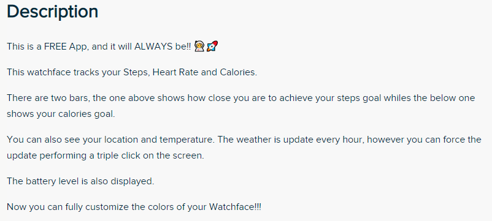
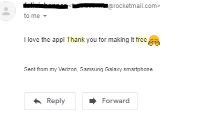
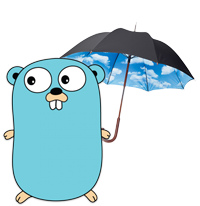

## Introduction

My life with development started at 2001, when I was learning HTML, Javascript and Photoshop. But for me, with 13 years old it was pointless having the knowledge and not using it.

Then I started creating websites for everything. My first was called ["It is good HP"](https://bit.ly/itisgoodhp) had aeroplane pictures and jokes. Then I created uncountable others for my friends.

This was a website I develop for a friend's party:

Every time I wanted to learn something I created an excuse to develop something.

And I never charged one single penny for any of them. First of all, because I am privileged, living at my parents and didn't need the money. Secondly, I was getting what I really wanted, the knowledge.

I did a lot, and almost 20 years later I keep finding excuses to develop free stuff. 

## Goat Face

In this post, I will talk about "Goat Face", a Fitbit Clockface I developed. If you have a Fitbit you can download it For Free at [https://gallery.fitbit.com/details/8ed33baf-d069-4405-a86c-289dc4b7e15d](https://gallery.fitbit.com/details/8ed33baf-d069-4405-a86c-289dc4b7e15d)

For those interested Fitbit provides an SDK quite simple to implement and you can publish your clockface at their gallery.

The Fitbit Gallery itself doesn't have any paid apps by concept, however, one day a developer found a way of charging. Making the clockface available for free and then locking it, so the user has to access a website to pay and get an unlock code.

I won't discuss if this is fair or not, but I can say it bothered me. You couldn't really know it was a paid app until you download and get that locked screen 😡.

So what did I do? Developed a Free App of course! And made clear on the description that it is free:

I can say it is a success. 4.4 ⭐⭐⭐⭐, 879 ratings until the moment of this post and lots of messages of support on my inbox.

## The issues started and the Solution came straight away

As I don't charge for this app, I also don't want to pay anything to make it available. However, the App has the temperature and location of the user, and this is a Third Party service which I am subject to a free tier. I was consuming it directly from the watch and the day that I exceeded it started. So the weather feature stopped working for all the users. 

Lot's of requests come from big cities like New York, Sydney, etc. also, if the user opened another app and came back to the clockface it was requesting again. What to do then? 

Cache the weather! But I would need my own weather service to do that across all the users that will imply in hosting that and be subject to another free tier. No problem, I could do in Go so it would be lightweight and I can handle loads of requests. 

Then I developed WeatherGo - [https://github.com/flaviojmendes/weathergo](https://github.com/flaviojmendes/weathergo).

It is totally customizable. Currently, it uses OpenWeatherAPI but you can write your own provider if you want. This Readme has all the details to run it [https://github.com/flaviojmendes/weathergo/blob/master/README.md](https://github.com/flaviojmendes/weathergo/blob/master/README.md) .

## Final thoughts

I can say I am proud of what I've done. This service receives **~120k daily requests**, which represents nearly **5k active users** that are getting it for Free. Also, I had the opportunity to learn how to develop for Fitbit and put a Go application live.
